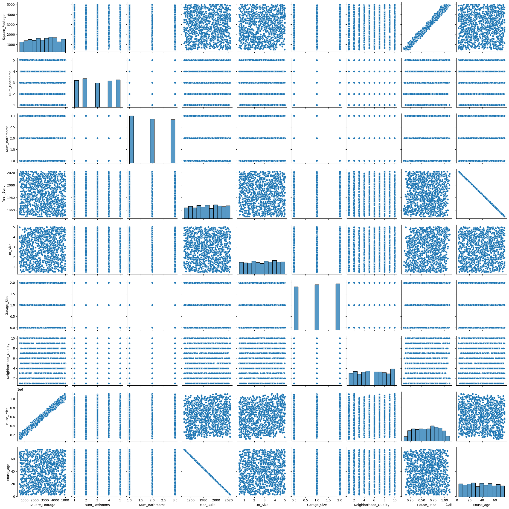
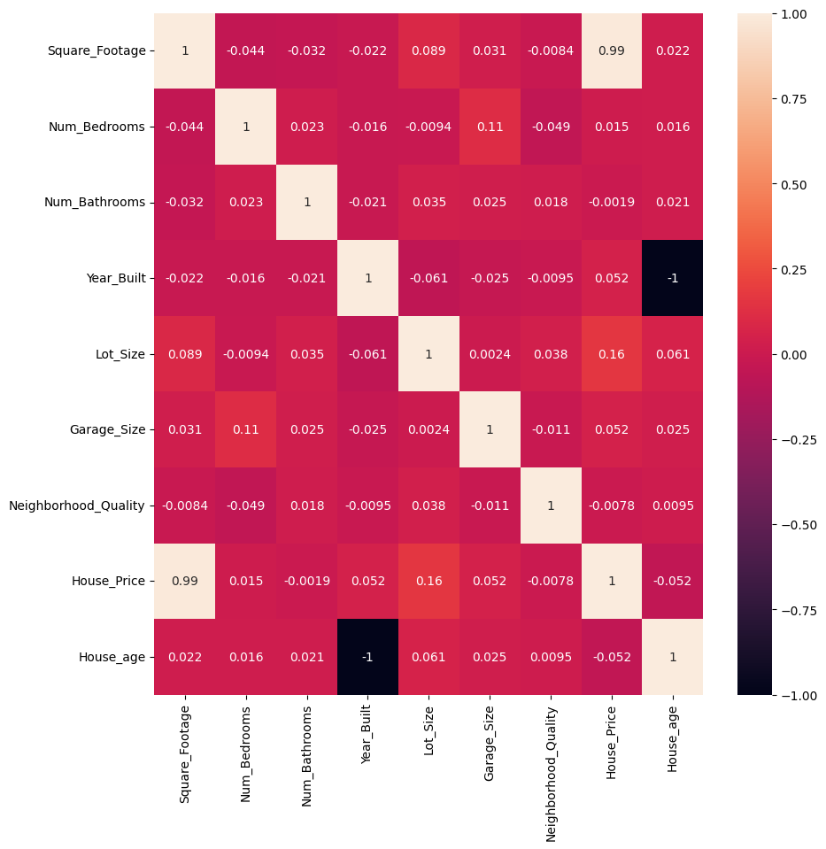
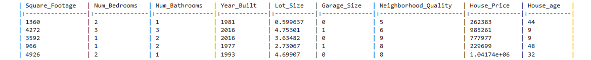

#  House Price Prediction Using Regression

A machine learning project that predicts house prices based on property features using regression techniques.

---

##  Overview

This project demonstrates a complete machine learning workflow:
- Data preprocessing  
- Feature engineering  
- Model training  
- Model evaluation  

The goal is to understand how different features affect house prices and build a reliable prediction model.

---

##  Problem Statement

Predict house prices using structured data such as:
- Square Footage  
- Number of Bedrooms & Bathrooms  
- Lot Size  
- Year Built
  

---

##  Approach

1. Load and explore the dataset  
2. Clean and preprocess the data  
3. Create a new feature: `House_age`  
4. Split data into training and testing sets (80:20)  
5. Train a regression model (OLS)  
6. Evaluate performance on test data  

---

##  Model Details

- **Type:** Supervised Learning (Regression)  
- **Algorithm:** Linear Regression (OLS)  
- **Target:** House Price  
- **Metrics:** R² Score  

---

##  Key Insights

- Square Footage has the strongest impact on price  
- Lot Size also significantly affects price  
- Older houses tend to have lower prices
  

---

##  Results

- **Train R² Score:** ~0.999  
- **Test R² Score:** ~0.998  

The model performs well and captures the relationship between features and house prices.



---
## Tech Stack

- Python  
- Pandas, NumPy  
- Matplotlib, Seaborn  
- Statsmodels, Scikit-learn  

---

##  Dataset

- Structured tabular data  
- Numerical features describing house properties  
- Target variable: House Price  

---

---

## Repository Structure
```
house-price-prediction-regression/
│
├── data/
│ └── house_price.csv
│
├── notebooks/
│ └── House_Price_Prediction.ipynb
│
├── README.md
├── requirements.txt
└── LICENSE
```
---

## Future Improvements

- Address multicollinearity between features   
- Deploy as a web application (Streamlit)  


